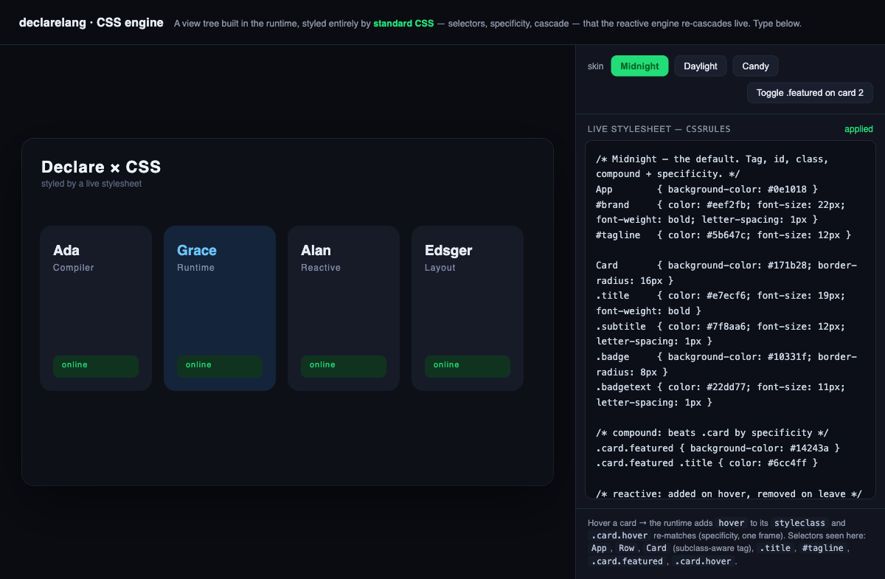

# CSS engine playground

A live demonstration of declarelang's standard-CSS styling channel (the
`design-docs/css-engine-and-screen-update.md` work, milestones M0–M3).

A view tree is built in the runtime and mounted with the DOM backend; its entire
**appearance** is driven by standard CSS — selectors, specificity, cascade — fed
into the root's `cssRules`. Edit the stylesheet on the right and the reactive
engine re-cascades the tree live, in one frame.



## What it shows

- **Real CSS the runtime honors** — `App`, `Row`, `Card` (subclass-aware **tag**
  selectors), `#brand`/`#tagline` (**id**), `.title`/`.badge` (**class**),
  `.card.featured` (**compound**, beating `.card` on specificity), and
  `.card.featured .title` (**descendant**).
- **W3C property names** translated by the per-attribute coercers:
  `background-color`→`fill`, `color`→`textColor`, `font-size`, `border-radius`→
  `cornerRadius`, `letter-spacing`, `font-weight`.
- **Live editing** — type in the stylesheet box; `buildRuleSet(text)` rebuilds
  the `RuleSet` and the tree re-cascades on the next settle.
- **Skin hot-swap** — Midnight / Daylight / Candy are three complete
  stylesheets; one click reassigns `cssRules` and the whole UI re-skins.
- **Reactive re-match** — hovering a card adds `hover` to its `styleclass`;
  `.card.hover` re-matches and restyles, then reverts on leave. The "spotlight"
  button toggles `.featured` on a card to show class-driven restyle.

Because compile-time CSS parsing is milestone M5, the demo builds the tree and
feeds `cssRules` from JavaScript (the runtime API). The engine itself is exactly
what ships in `runtime/src/css-*.ts`.

## Run it

```bash
npm run build                 # builds runtime/dist (the demo imports it)
# then serve the distro tree and open the page:
python3 -m http.server 8351   # (or: npm start)
open http://127.0.0.1:8351/demo/css-playground.html
```

The page imports `App`, `View`, `Text`, `mountApp`, `DomBackend`, `settle` from
`/runtime/dist/index.js` and `buildRuleSet` from `/runtime/dist/css-match.js`.
