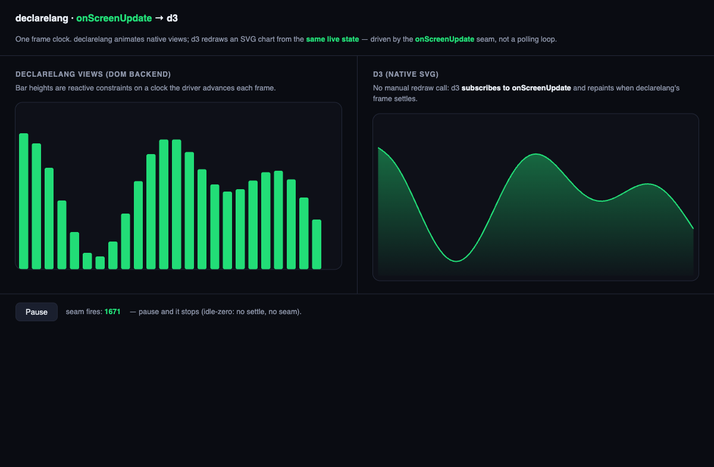

# onScreenUpdate → d3

A live demonstration of the `onScreenUpdate` screen-update seam: **one frame
clock, two renderers.**



A declarelang app animates a row of native bars (heights are reactive
constraints on a clock the driver advances each frame). A d3 area chart, in
native SVG, plots the **same live state** — and it never calls its own redraw.
It subscribes to `onScreenUpdate` and repaints exactly when declarelang's frame
settles:

```js
onScreenUpdate(() => {
  const vals = bars.map((b) => b.height); // read declarelang's current state
  areaPath.attr("d", area(vals));         // d3 repaints in lockstep
});
```

The driver only advances the clock (`app.t = …`) — one reactive write per frame.
declarelang does the rest: the bar constraints invalidate, the engine settles
(microtask), and `onScreenUpdate` fires once. There is no `settle()` call in the
loop and no polling.

## What it shows

- **The seam is the frame boundary.** External rendering (d3) hangs off one named
  hook, in sync with declarelang's own frame — no shared timer, no rAF race.
- **Idle-zero.** Hit *Pause*: the clock stops, nothing settles, and the seam goes
  quiet (`seam fires` stops incrementing). The seam is tied to real frame
  activity, not a polling loop.
- **Backend-neutral timing.** The bars render through the DOM backend; the seam
  fires from the reactive `settle`, independent of any backend's paint.

## Run it

```bash
npm run build                 # builds runtime/dist (the demo imports it)
python3 -m http.server 8352   # (or: npm start)
open http://127.0.0.1:8352/demo/screen-update-d3.html
```

d3 v7 is vendored (`vendor/d3.v7.min.js`) so the demo is self-contained. It
imports `App`, `View`, `mountApp`, `DomBackend` from `/runtime/dist/index.js`,
`defineAttributes`/`bindDerived` from `/runtime/dist/attributes.js`, and
`onScreenUpdate` from `/runtime/dist/screen-update.js`.
